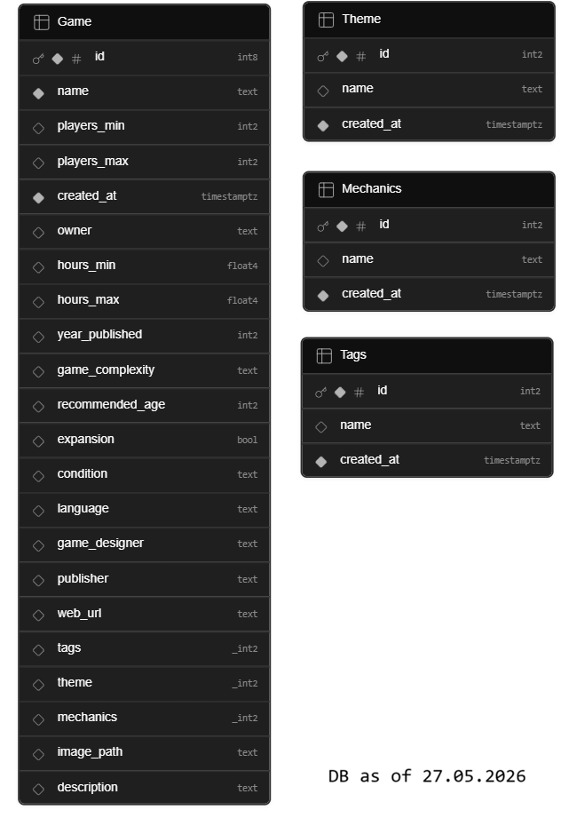

### Database:

### Resources
[OsloMet Game Bank Assistant](https://chatgpt.com/g/g-6a16004ed77081918f9f86b9266a938b-oslomet-game-bank-assistant)

[image-preview bootstrap](https://stackoverflow.com/questions/34173254/bootstrap-file-upload-with-image-preview)

[Boootstrap edit svg](https://icons.getbootstrap.com/icons/pencil-square/)

[extract.pics](https://extract.pics/)

[GitHub Pages](https://sspect.github.io/omg-game-bank/games.html)

[GitHub](https://github.com/Sspect/omg-game-bank)

[OsloMet Game Bank Assistant](https://chatgpt.com/g/g-6a16004ed77081918f9f86b9266a938b-oslomet-game-bank-assistant)

[Assistant video demo](https://www.youtube.com/watch?v=6iog8Ww8rqQ)

1. User selects image
2. JavaScript uploads image to Supabase Storage bucket
3. Supabase returns file path
4. Insert game row with image_path
5. Display image using public URL

som games for testing:
Ticket to Ride: Europe
here to slay
happy little dinosaurs
unstable unicorns
a place for all my books
stardew valley the board game 

todo:

rename complete: tags -> vibes